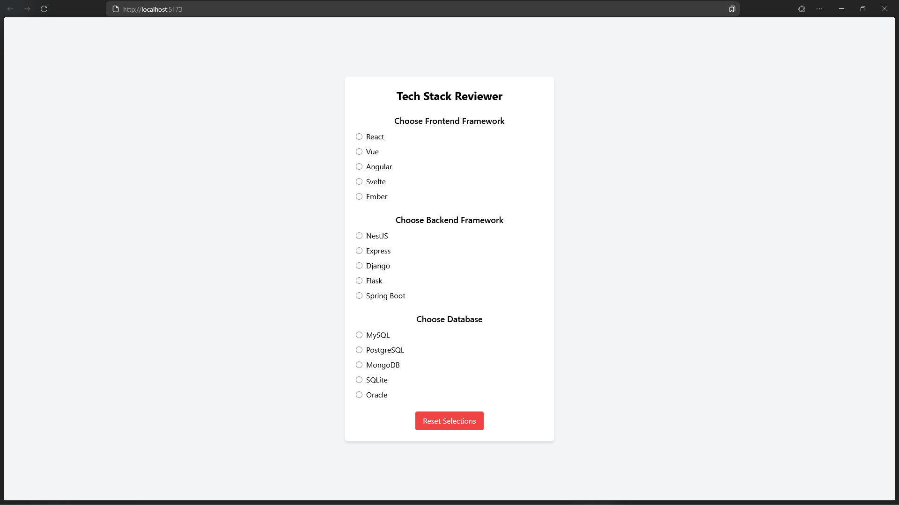
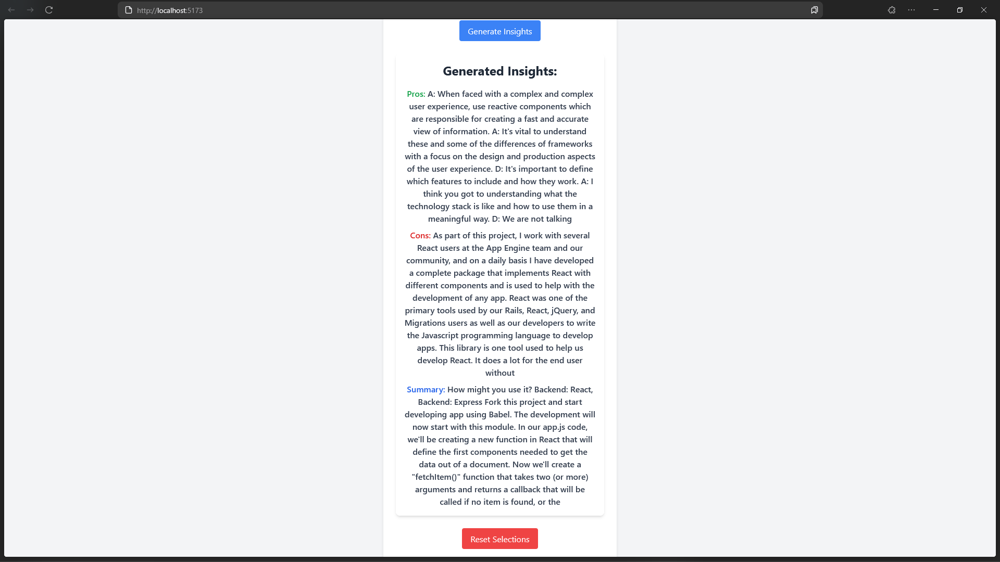

# Stackreviewer

## Requirements

- Nodejs and vite latest version
- run `pip install -r requirements.txt` in home directory

## Run the web page 
Go to `stackreviewer` directory and run

```bash
npm run dev
```

## Run the AI model
Go to  `ai_stackreviewer` directory and run

```bash
python app.py
```

## Sample program

Tech stack selection


Model answer



